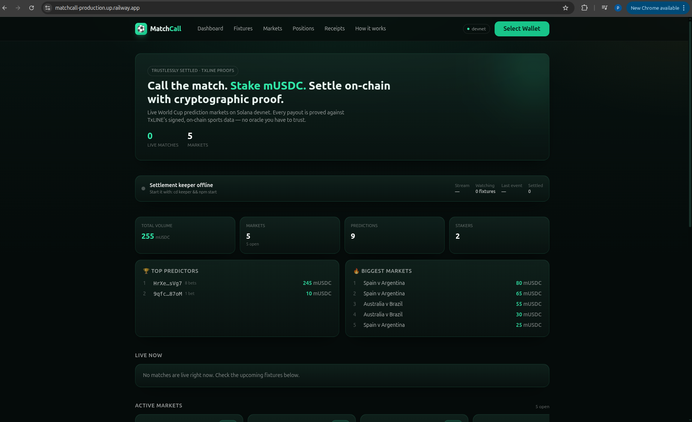
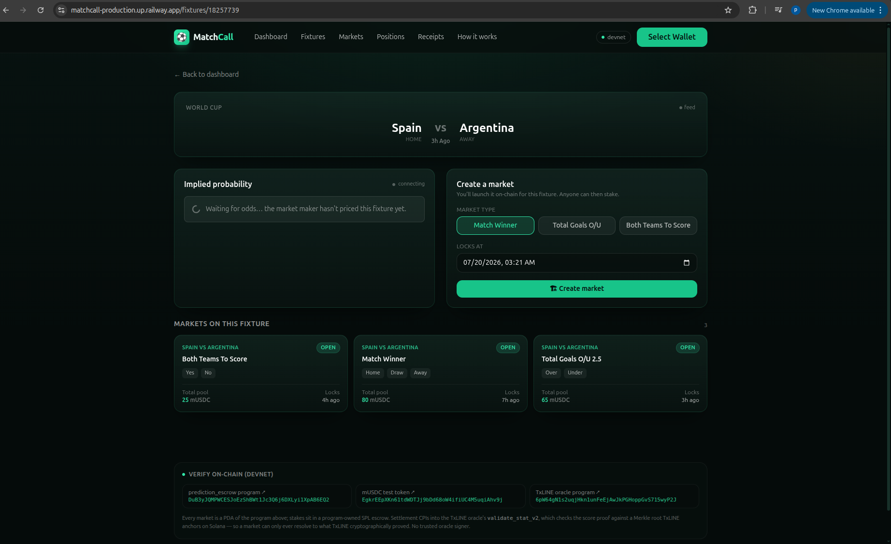
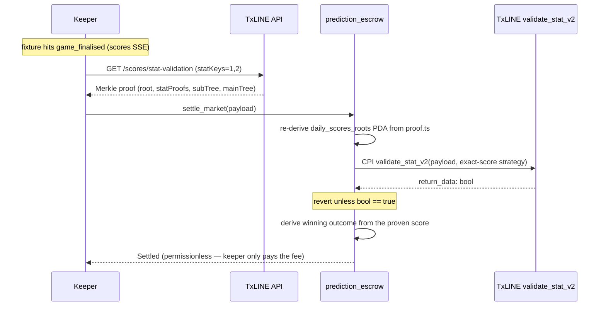

# MatchCall ⚽️🔗

**A live, trustlessly-settled World Cup prediction market on Solana devnet, backed by TxLINE.**

MatchCall lets anyone open a prediction market on a real World Cup fixture —
match winner, over/under goals, or both-teams-to-score — stake a devnet test
stablecoin (mUSDC), and watch odds and scores move live. When the final whistle
blows, the market **settles itself**: a keeper submits a cryptographic proof of
the final score, the on-chain program verifies it, and winners pull their
pari-mutuel payout. No trusted admin ever picks the winner.

> Program ID (devnet): `DuB3yJQMPWCESJoEzShBWt1Jc3Q6j6DXLyi1XpAB6EQ2`
> mUSDC mint (devnet): `EgkrEEpXKn61tdWDTJj9bDd68oW4ifiUC4M5uqiAhv9j`


**Verify everything on-chain:**
[prediction_escrow](https://explorer.solana.com/address/DuB3yJQMPWCESJoEzShBWt1Jc3Q6j6DXLyi1XpAB6EQ2?cluster=devnet)
· [mUSDC mint](https://explorer.solana.com/address/EgkrEEpXKn61tdWDTJj9bDd68oW4ifiUC4M5uqiAhv9j?cluster=devnet)
· [TxLINE oracle](https://explorer.solana.com/address/6pW64gN1s2uqjHkn1unFeEjAwJkPGHoppGvS715wyP2J?cluster=devnet)

### Why it stands out

- 🔒 **Genuinely trustless settlement** — the on-chain program CPIs into TxLINE's `validate_stat_v2` and derives the winner from a cryptographic proof of the final score. No admin, keeper, or backend can move the result.
- 💰 **Real SPL-token escrow** — stakes sit in a program-owned mUSDC escrow (our own devnet test token — never the restricted TxL), paid out pari-mutuel.
- ⚡ **End-to-end live** — program + mUSDC + config deployed on devnet, real TxLINE World Cup data, wallet staking that moves real (devnet) value.
- 🤖 **Automatic settlement** — a keeper watches the live scores SSE and settles at full-time, no human trigger.
- 🧾 **Verifiable receipts** — every settled market shows the TxLINE score → Merkle proof → on-chain settlement tx, re-verifiable by anyone.
- 🎛️ **Product-complete** — Dashboard, Fixtures, Markets, Positions, Receipts, live analytics/leaderboards, a real-time activity feed, wallet connect, claim.
- ✅ **Test-backed & deploy-ready** — 14 passing tests (6 on-chain + 8 settlement-logic) + a one-command Docker deploy.

---

## Demo

- 🌐 **Live app:** **https://matchcall-production.up.railway.app** — open it, connect
  Phantom (set to **Devnet**), click **"Get test mUSDC"** (gives you mUSDC *and* gas),
  and stake. Fully self-serve; nothing to install.
- 🎥 **Video (≤5 min):** _[[ add link ]]_ — script in [docs/DEMO_SCRIPT.md](docs/DEMO_SCRIPT.md).

**What the demo shows:**
1. Live fixtures + real-time analytics, leaderboards, and an activity feed.
2. Connect wallet → one-click **mUSDC + gas** → stake into the on-chain escrow (appears in the live feed instantly).
3. Your **Positions** and a market's **verifiable receipt** (score → Merkle proof → on-chain tx).
4. **Trustless settlement** — the `validate_stat_v2` CPI explained on the *How it works* page, and backed by the 14 passing tests. At full-time the keeper settles automatically.

---

## The problem

Every prediction market has the same weak point: **who decides the outcome?**
Most rely on a trusted oracle, a multisig, or an operator who could resolve a
market wrong — by mistake or malice — and there's no way for stakers to prove it.

MatchCall removes that trust. TxLINE (TxODDS's sports-data feed) anchors a
Merkle root of every day's scores on Solana and exposes an on-chain
`validate_stat_v2` instruction that verifies a score against that root. MatchCall's
program **CPIs into `validate_stat_v2`** and derives the winning outcome *only*
from what TxLINE cryptographically proved. The market can resolve to exactly one
thing: the real final score. The keeper, the market creator, and the backend are
all untrusted — none of them can move the result.

---

## In plain English — a worked example

Take **Spain vs Argentina**.

1. **Create a market.** Someone opens a *Match Winner* market on that fixture. This
   creates an on-chain account (a PDA) with three outcomes — Home / Draw / Away —
   and a program-owned SPL escrow to hold the stakes.
2. **People stake.** Alice connects her wallet, clicks *Get test mUSDC* (which gives
   her mUSDC **plus** a little SOL for gas), and stakes **100 mUSDC on Spain (Home)**.
   Bob stakes **50 mUSDC on Argentina (Away)**. Their 150 mUSDC now sits in the
   program escrow — no admin holds the money. The live pools + activity feed update
   instantly.
3. **The match plays.** Live scores stream from TxLINE; betting locks at kickoff.
4. **Full-time → settlement.** It ends **Spain 2–1 Argentina**. A keeper bot spots the
   final whistle, fetches TxLINE's Merkle proof of the score, and calls
   `settle_market` — which **CPIs into TxLINE's on-chain `validate_stat_v2`**. That
   verifies the proof against the root TxLINE anchored on Solana; if the proof were
   fake, the transaction reverts. The program reads *Spain 2, Argentina 1* **from the
   proven data** and derives the winner: **Home**. Nobody supplied the outcome — it
   came from the proof.
5. **Payout.** Alice backed the winner, so she claims her pari-mutuel share of the
   whole 150 mUSDC pool. Bob loses his stake. (If nobody had backed the proven
   outcome, everyone would get an automatic refund instead.)
6. **Receipt.** Anyone can open the market's receipt: the final score, the Merkle
   proof, and a link to the settlement transaction on Solana Explorer — fully
   re-verifiable.

> **In one line:** bet on real matches with real on-chain money, and the winner is
> settled by a cryptographic proof verified on the blockchain — so the result is
> provably the real score, not whatever an operator claims.

---

## Architecture

```
                         ┌─────────────────────────────────────────────┐
                         │                 TxLINE                       │
                         │  REST + SSE feed  ·  on-chain validate_stat  │
                         │  daily_scores_roots PDA (Merkle roots)       │
                         └───────▲───────────────────▲─────────────────┘
                                 │ proofs / scores    │ CPI verify
             fixtures, scores,   │                    │
             stat-validation     │                    │
                                 │                    │
   ┌──────────┐   REST/SSE  ┌────┴───────┐   tx   ┌───┴──────────────────┐
   │ Frontend │◄───────────►│  Backend   │◄──────►│  prediction_escrow   │
   │ Next.js  │  /api/*     │ Next.js API│        │  (Anchor program)    │
   │ wallet   │             │ + SQLite   │        │  markets · escrow ·  │
   └──────────┘             └────▲───────┘        │  positions · settle  │
                                 │                └──────────▲───────────┘
                       GET /api/markets                      │ settle_market
                       POST /api/keeper/settle               │ (permissionless)
                                 │                            │
                            ┌────┴───────┐   watch SSE   ─────┘
                            │  Keeper    │◄───────────── TxLINE /scores/stream
                            │ (this repo)│   detect full-time, capture seq
                            └────────────┘
```

- **Frontend** (`app/app`, `app/components`) — never sees TxLINE credentials;
  talks only to the backend. Shows live odds/implied-probability bars, score
  tickers, and lets a wallet stake and claim.
- **Backend** (`app/app/api`, `app/lib`, `scripts`) — proxies TxLINE, creates
  markets on-chain with the market authority, builds unsigned staking/claim
  transactions for the wallet to sign, and records settlement receipts.
- **On-chain** (`programs/prediction_escrow`) — holds stakes in a market-owned
  SPL escrow and settles trustlessly by CPI into TxLINE.
- **Keeper** (`keeper/`) — watches live scores and triggers settlement at
  full-time. See [`keeper/README.md`](keeper/README.md).

---

## Screenshots

_Drop your captures into `docs/screenshots/` with these names and they render below._

| Dashboard (live keeper status, analytics, activity feed) | Fixture → create market + implied-probability odds |
| :--: | :--: |
|  |  |
| **Stake mUSDC via wallet (Phantom, devnet)** | **Verifiable receipt: TxLINE score → Merkle proof → on-chain tx** |
|  |  |

---

## Monorepo layout

```
matchcall/
├── app/                       # Next.js frontend + backend API routes + SQLite
│   ├── app/(pages)            #   frontend pages (frontend-owned)
│   ├── app/api/               #   backend HTTP/JSON + SSE proxy routes
│   ├── lib/                   #   backend: txline client, on-chain client, db
│   └── .env.local             #   server-side secrets (not committed)
├── programs/
│   └── prediction_escrow/     # Anchor 0.32.1 program (Rust)
├── keeper/                    # standalone settlement keeper (Node/TS) — this task
├── scripts/                   # devnet ops: activate, mint mUSDC, init config
├── docs/
│   ├── SPEC.md                # authoritative build contract
│   ├── TECHNICAL.md           # architecture + settlement CPI deep-dive
│   ├── FEEDBACK.md            # TxLINE API friction + highlights
│   └── DEMO_SCRIPT.md         # <=5 min demo video script
├── target/idl/                # Anchor IDL (after `anchor build`)
├── Anchor.toml
└── README.md                  # you are here
```

---

## Setup

> **One-command path:** with a funded deployer keypair (`.keys/deployer.json`),
> `./bootstrap.sh` runs deploy → mint mUSDC → init config → TxLINE activate in one
> go, then `cd app && npm run dev` + `cd keeper && npm start`. The manual steps
> below explain each stage.

### Prerequisites

| Tool | Version |
| --- | --- |
| Node.js | 18+ (native `fetch`, web streams) |
| Rust | stable (with the Solana BPF toolchain) |
| Solana CLI | 1.18+ |
| Anchor | **0.32.1** (`avm install 0.32.1 && avm use 0.32.1`) |

### 1. Install

```bash
git clone <repo> && cd matchcall
(cd app && npm install)
(cd keeper && npm install)
```

### 2. Build & deploy the program (devnet)

```bash
solana config set --url https://api.devnet.solana.com

# Fund the deployer (keypair in .keys/deployer.json). Airdrops are rate-limited;
# scripts/airdrop-loop.sh retries until funded.
solana airdrop 2 --keypair .keys/deployer.json
./scripts/airdrop-loop.sh          # optional: keep retrying to reach ~5 SOL

# Anchor 0.32.1's bundled `anchor build` pins an older platform-tools that can't
# parse a newer edition2024 dependency; build the .so + IDL with a newer toolchain:
./scripts/build-program.sh          # cargo-build-sbf (platform-tools v1.52) + IDL
solana program deploy target/deploy/prediction_escrow.so \
  --program-id target/deploy/prediction_escrow-keypair.json
```

The program ID is pinned in `Anchor.toml` and `declare_id!` — a fresh deploy
must reuse the same keypair or update both.

### 3. Configure env

Create `app/.env.local`:

```bash
SOLANA_RPC_URL=https://api.devnet.solana.com
PREDICTION_ESCROW_PROGRAM_ID=DuB3yJQMPWCESJoEzShBWt1Jc3Q6j6DXLyi1XpAB6EQ2
MUSDC_MINT=EgkrEEpXKn61tdWDTJj9bDd68oW4ifiUC4M5uqiAhv9j
MARKET_AUTHORITY_SECRET=[/* json byte array of the authority keypair */]
TXLINE_BASE_URL=https://txline-dev.txodds.com/api/
TXLINE_AUTH_JWT=          # filled by txline:activate
TXLINE_API_TOKEN=         # filled by txline:activate
DATABASE_PATH=./matchcall.db

NEXT_PUBLIC_RPC_URL=https://api.devnet.solana.com
NEXT_PUBLIC_PROGRAM_ID=DuB3yJQMPWCESJoEzShBWt1Jc3Q6j6DXLyi1XpAB6EQ2
NEXT_PUBLIC_MUSDC_MINT=EgkrEEpXKn61tdWDTJj9bDd68oW4ifiUC4M5uqiAhv9j
```

### 4. Mint mUSDC (devnet test stablecoin)

```bash
cd app && npm run mint:musdc      # scripts/mint-musdc.ts — creates/mints EgkrEE…hv9j (6 dp)
```

### 5. Initialize the on-chain config

```bash
cd app && npm run market:init     # scripts/init-config.ts — initialize_config(stake_mint = mUSDC)
```

### 6. Activate the TxLINE World Cup free tier

Subscribes on the TxLINE devnet program (`subscribe(serviceLevelId=1, durationWeeks=4)`,
`selectedLeagues=[]`), then signs the activation message and writes
`TXLINE_AUTH_JWT` + `TXLINE_API_TOKEN` into `app/.env.local`:

```bash
cd app && npm run txline:activate
```

> The activation message for the empty-leagues free bundle is `${txSig}::${jwt}`
> (two colons — `selectedLeagues.join(",")` is empty). Devnet TxL airdrops are
> rate-limited; the subscribe step may need a retry. See [docs/FEEDBACK.md](docs/FEEDBACK.md).

### 7. Run

```bash
# terminal 1 — backend + frontend
cd app && npm run dev             # http://localhost:3000

# terminal 2 — settlement keeper
cd keeper && npm start
```

Open the app, create a market on a live/finished World Cup fixture, stake mUSDC,
and watch the keeper settle it at full-time.

---

## TxLINE endpoints used

Base `https://txline-dev.txodds.com/api/`; headers `Authorization: Bearer <jwt>`
and `X-Api-Token: <apiToken>`.

| Method | Endpoint | Used for |
| --- | --- | --- |
| `GET` | `/fixtures/snapshot?competitionId=<id>` | Upcoming/live World Cup fixtures for market creation |
| `GET` | `/scores/snapshot/{fixtureId}` | Current score (recovery) |
| `GET` | `/scores/historical/{fixtureId}` | Replay missed score events (recovery) |
| `GET` | `/scores/stream` (SSE) | Live scores; keeper detects full-time & tracks `seq` |
| `GET` | `/odds/stream` (SSE) · `/odds/snapshot/{fixtureId}` | Live odds / implied probability |
| `GET` | `/scores/stat-validation?fixtureId=&seq=&statKeys=1,2` | **Merkle proof** of the two full-game goal totals (V2) |
| `POST` | `https://txline-dev.txodds.com/auth/guest/start` | Guest JWT; renewed on `401` |
| `POST` | `https://txline-dev.txodds.com/api/token/activate` | Exchange wallet-signed subscription tx for the API token |
| `GET` | `https://txline.txodds.com/documentation/programs/devnet.md` | Fetch the TxLINE devnet IDL (setup/smoke-test only) |

TxLINE Solana program (`6pW64gN1s2uqjHkn1unFeEjAwJkPGHoppGvS715wyP2J`):
`subscribe` provisions the service; `validate_stat_v2` is CPI-called by our
program to verify the final score.

---

## How trustless settlement works

At full-time the keeper fetches the TxLINE Merkle proof for the two full-game
goal totals (`statKeys=1,2`) and submits `settle_market(payload)`.



Inside the program:

1. **The roots account is pinned to the proof, not the caller.** From the proof's
   own timestamp (`updateStats.minTimestamp`), the program derives the TxLINE
   `daily_scores_roots` PDA — seeds `["daily_scores_roots", u16_le(floor(ts_ms/86_400_000))]`
   — and requires the supplied account to equal it *and* be owned by the TxLINE
   program. A caller cannot substitute a forged roots account.
2. **The score is proven, not asserted.** The program builds an *exact-equality*
   strategy over the two proven leaves and CPIs into TxLINE `validate_stat_v2`.
   TxLINE re-hashes the leaves up to its anchored Merkle root and returns a
   `bool` via `get_return_data`. The program requires that bool to be `true`;
   otherwise settlement reverts.
3. **The winner is derived on-chain.** From the two proven goal values the program
   computes home/away goals and the winning outcome for the market type
   (match-winner / totals / BTTS). The caller supplies **no** outcome — the market
   can only resolve to the proven score. If nobody backed the proven outcome, the
   market flips to `Refunding` and every staker reclaims their stake.

Because the outcome is *derived from a cryptographic proof verified in the same
transaction*, settlement is permissionless: the keeper is only a fee-payer. See
[docs/TECHNICAL.md](docs/TECHNICAL.md) for the discriminator, payload layout, and
the reasoning behind CPI-ing into `validate_stat_v2` instead of re-verifying the
Merkle proof ourselves.

---

## Tests

**14 tests total** — 6 on-chain integration + 8 pure settlement-logic.

### On-chain integration (against the deployed devnet program, no rebuild)

```bash
cd tests && npm install && npm test
```

```
prediction_escrow (devnet, deployed program)
  ✔ config PDA is initialized and decodes (admin, stake_mint == mUSDC)
  ✔ create_market: creates a MATCH_WINNER market that decodes correctly
  ✔ place_prediction: stakes on an outcome; Position decodes and escrow balance increases
  ✔ negative: settle_market before lock reverts with MarketStillOpen
  ✔ negative: place_prediction after lock reverts with MarketLocked
  ✔ negative: settle_market with the wrong TxLINE program reverts with InvalidTxlineProgram
  6 passing (20s)
```

### Settlement-decision logic (pure, deterministic, no chain / no live match)

```bash
cd app && npm run test:settlement
```

```
settlement logic (pure, no chain)
  ✔ game_finalised (statusId 100, period 100) is detected as final
  ✔ game_finalised WITHOUT the 100/100 marker is NOT final
  ✔ a live in-play goal event is NOT final
  ✔ parseTxlineScoreProof yields the 2 total-goal stats (key 1,2 / period 0)
  ✔ a malformed proof (wrong stat keys) is rejected
  ✔ MATCH_WINNER: home win / draw / away win
  ✔ TOTALS O/U 2.5 (lineParam 5): over vs under
  ✔ BTTS: yes when both scored, no otherwise
  8 passing
```

Together these cover the whole settlement path — **when** to settle (full-time
detection), **how** the proof maps to the on-chain payload, **what** outcome each
market resolves to, and that the program **refuses to settle without a valid
TxLINE proof** (the CPI guards). The only step not unit-testable is a *genuine*
TxLINE `game_finalised` Merkle proof flipping a market to SETTLED — that needs a
match to actually end, and is completed automatically by the keeper / live demo.

---

## Deploying

`better-sqlite3` is a native module with a local DB file and the keeper is a
persistent process, so deploy to a **container host** (Railway / Render / Fly / any
VPS), not a serverless platform:

```bash
cp app/.env.example .env    # fill MARKET_AUTHORITY_SECRET, TXLINE_AUTH_JWT, TXLINE_API_TOKEN
docker compose up --build   # app on :3000 + keeper, with a /data volume for the DB
```

Full instructions (Railway two-service setup, volume, and why not Vercel) in
[docs/DEPLOY.md](docs/DEPLOY.md).

---

## License

Devnet hackathon project. Devnet SOL/mUSDC have no real-world value. A mainnet
release would require an audit, legal review, and multisig authority setup.
